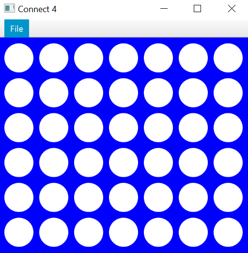
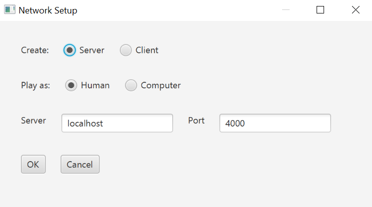
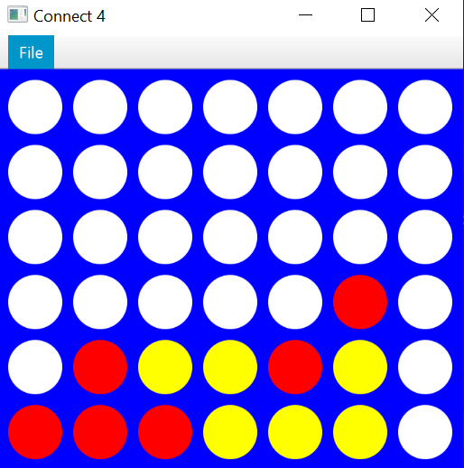

# Networked Connect 4

<!-- TABLE OF CONTENTS -->
<h2 id="table-of-contents">Contents</h2>
  <ol>
    <li><a href="#desc"> ➤ Description</a></li>
    <li><a href="#board"> ➤ Main Board</a></li>
  </ol>
 
<h2 id="desc"> 1. Description</h2>

This project is to implement the game of Connect 4 using all of the tools we 
have learned so far. That means you should follow the MVC design, use UML to
plan and document your class structure, provide full source code documentation
using javadoc, a complete test suite that tests your controller to 100% 
statement coverage, and, of course, works.

The computer “AI” will be a random player. Have it choose a legal move 
randomly.

We will construct a Connect4View that is a javafx.application.Application and
use a GridPane to hold javafx.scene.shape.Circle objects representing our empty
spaces (white) or our player and computer tokens (yellow and red).

 
<h2 id="board"> 2. Main Board</h2>

